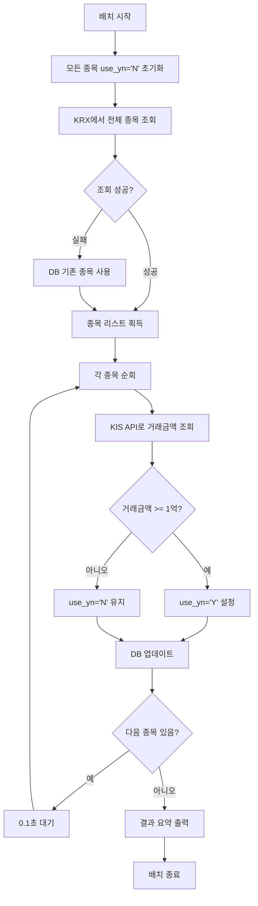
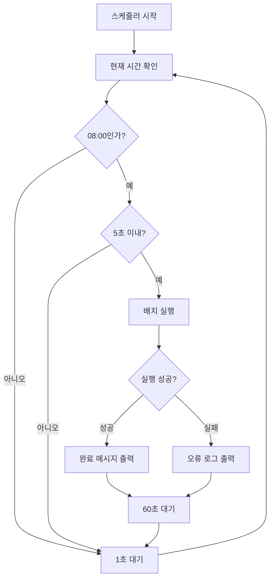

# 배치 작업 문서

## 개요
이 프로젝트에는 주식 정보를 자동으로 업데이트하는 배치 작업이 구현되어 있습니다.

---

## 배치 작업 목록

### 1. 주식 정보 업데이트 배치 (`batch_update_stocks.py`)

#### 목적
한국거래소(KRX)에서 전체 종목 정보를 조회하고, 거래금액 기준으로 필터링하여 데이터베이스를 업데이트합니다.

#### 주요 기능

##### 1.1 종목 초기화
- 모든 종목의 `use_yn` 플래그를 'N'으로 초기화
- 배치 실행 시마다 새로운 기준으로 종목을 재평가

##### 1.2 전체 종목 조회
- **데이터 소스**: 한국거래소(KRX) API
- **조회 범위**: KOSPI + KOSDAQ 전체 종목
- **조회 방식**: OTP(One Time Password) 방식
- **대체 로직**: KRX 조회 실패 시 DB의 기존 종목 사용

##### 1.3 종목 정보 업데이트
- 각 종목의 실시간 거래금액 조회 (KIS API 사용)
- 거래금액 기준 필터링
  - **기준**: 거래금액 1억원 이상
  - **1억원 이상**: `use_yn = 'Y'` (활성)
  - **1억원 미만**: `use_yn = 'N'` (비활성)
- UPSERT 방식으로 DB 업데이트

##### 1.4 API 호출 제한 관리
- 초당 10건 제한 준수 (0.1초 대기)

#### 실행 방법

```bash
# 직접 실행
python batch_update_stocks.py
```

#### 처리 흐름



#### 출력 예시

```
============================================================
거래금액 필터링 배치 작업 시작
기준: 거래금액 100,000,000원 이상
============================================================
모든 종목의 use_yn을 'N'으로 초기화 중...
초기화 완료
KRX에서 전체 종목 리스트 다운로드 중...
총 2,500개 종목 조회 완료

조회 대상 종목 수: 2,500개

  ✓ 005930 (삼성전자): 1,234,567,890원 -> use_yn=Y
  ✓ 000660 (SK하이닉스): 987,654,321원 -> use_yn=Y
진행 중... [100/2500]
...

============================================================
배치 작업 완료
처리 성공: 2,500/2,500개
활성 종목(use_yn='Y'): 450개
============================================================
```

#### 관련 클래스 및 메서드

| 클래스/메서드 | 설명 |
|-------------|------|
| `StockBatchUpdater` | 배치 작업 메인 클래스 |
| `reset_all_stocks()` | 모든 종목 초기화 |
| `get_all_stock_codes_from_krx()` | KRX에서 종목 조회 |
| `get_existing_stocks()` | DB 기존 종목 조회 |
| `update_stock_info()` | 종목 정보 업데이트 |
| `run_batch()` | 배치 실행 메인 로직 |

---

### 2. 배치 스케줄러 (`batch_scheduler.py`)

#### 목적
주식 정보 업데이트 배치를 정해진 시간에 자동으로 실행합니다.

#### 주요 기능

##### 2.1 스케줄 관리
- **실행 시간**: 매일 오전 8시 (08:00)
- **실행 주기**: 매일 1회
- **중복 실행 방지**: 5초 이내 중복 실행 차단

##### 2.2 자동 실행
- 지정된 시간에 `StockBatchUpdater.run_batch()` 자동 호출
- 예외 발생 시 로그 출력 후 다음 스케줄 대기

##### 2.3 연속 실행
- 무한 루프로 계속 실행
- 1초마다 현재 시간 체크

#### 실행 방법

```bash
# 스케줄러 실행 (백그라운드 실행 권장)
python batch_scheduler.py

# 백그라운드 실행 (nohup 사용)
nohup python batch_scheduler.py > scheduler.log 2>&1 &
```

#### 처리 흐름



#### 출력 예시

```
============================================================
배치 스케줄러 시작
실행 시간: 매일 08:00
============================================================

[2025-12-05 08:00:01] 배치 작업 시작
============================================================
거래금액 필터링 배치 작업 시작
...
============================================================
다음 실행 예정: 내일 08:00
```

#### 관련 클래스 및 메서드

| 클래스/메서드 | 설명 |
|-------------|------|
| `BatchScheduler` | 스케줄러 메인 클래스 |
| `run_scheduler()` | 스케줄 실행 메인 로직 |

---

## 의존성

### 외부 라이브러리
- `requests`: KRX API 호출
- `time`: 시간 관리 및 대기
- `datetime`: 날짜/시간 처리

### 내부 모듈
- `db.database.Database`: 데이터베이스 연결 및 쿼리 실행
- `kis_api.KisApi`: 한국투자증권 API 연동

---

## 데이터베이스 스키마

### stock 테이블

| 컬럼명 | 타입 | 설명 |
|--------|------|------|
| `code` | VARCHAR | 종목 코드 (PK) |
| `name` | VARCHAR | 종목명 |
| `gubun` | VARCHAR | 구분 (STOCK) |
| `trade_amount` | BIGINT | 거래금액 |
| `use_yn` | CHAR(1) | 사용 여부 (Y/N) |

---

## 설정값

### 배치 업데이트 설정
- **최소 거래금액**: 100,000,000원 (1억원)
- **API 호출 간격**: 0.1초 (초당 10건)
- **시장 구분**: ALL (KOSPI + KOSDAQ)

### 스케줄러 설정
- **실행 시간**: 08:00
- **체크 주기**: 1초
- **중복 방지 시간**: 5초
- **대기 시간**: 60초 (실행 후)

---

## 운영 가이드

### 배치 작업 모니터링

#### 로그 확인
```bash
# 스케줄러 로그 확인
tail -f scheduler.log

# 실시간 로그 모니터링
watch -n 1 tail -n 50 scheduler.log
```

#### 활성 종목 확인
```sql
-- 활성 종목 수 확인
SELECT COUNT(*) FROM stock WHERE use_yn = 'Y';

-- 활성 종목 목록
SELECT code, name, trade_amount 
FROM stock 
WHERE use_yn = 'Y' 
ORDER BY trade_amount DESC;
```

### 수동 실행

#### 즉시 배치 실행
```bash
python batch_update_stocks.py
```

#### 특정 시간 변경
[batch_scheduler.py](file:///Users/changsupark/projects/stockauto/batch_scheduler.py#L7)의 `batch_time` 값 수정:
```python
self.batch_time = "09:00"  # 오전 9시로 변경
```

### 트러블슈팅

#### KRX 조회 실패
- **증상**: "KRX 조회 실패" 메시지 출력
- **원인**: KRX API 장애 또는 네트워크 문제
- **대응**: 자동으로 DB 기존 종목 사용

#### API 호출 제한 초과
- **증상**: KIS API 오류 발생
- **원인**: 초당 호출 제한 초과
- **대응**: [batch_update_stocks.py](file:///Users/changsupark/projects/stockauto/batch_update_stocks.py#L154)의 `sleep` 시간 증가

#### 배치 실행 시간 초과
- **증상**: 배치가 다음 스케줄 시간까지 완료되지 않음
- **원인**: 종목 수가 너무 많거나 API 응답 지연
- **대응**: 
  - API 호출 간격 감소 (주의: 호출 제한 고려)
  - 병렬 처리 구현 검토

---

## 향후 개선 사항

### 성능 개선
- [ ] 멀티스레딩/멀티프로세싱을 통한 병렬 처리
- [ ] 변경된 종목만 업데이트 (증분 업데이트)
- [ ] 배치 처리 단위 증가 (bulk insert/update)

### 기능 추가
- [ ] 배치 실행 이력 저장 (배치 로그 테이블)
- [ ] 이메일/슬랙 알림 기능
- [ ] 거래금액 기준 동적 설정 (config 파일)
- [ ] 재시도 로직 추가 (API 실패 시)

### 모니터링
- [ ] 배치 실행 시간 측정 및 기록
- [ ] 실패율 모니터링
- [ ] 대시보드 구현

---

## 참고 자료

### 관련 파일
- [batch_update_stocks.py](file:///Users/changsupark/projects/stockauto/batch_update_stocks.py) - 배치 작업 구현
- [batch_scheduler.py](file:///Users/changsupark/projects/stockauto/batch_scheduler.py) - 스케줄러 구현
- [kis_api.py](file:///Users/changsupark/projects/stockauto/kis_api.py) - KIS API 연동
- [db/database.py](file:///Users/changsupark/projects/stockauto/db/database.py) - 데이터베이스 연결

### 외부 API
- [한국거래소(KRX) 정보데이터시스템](http://data.krx.co.kr)
- 한국투자증권 KIS API

---

**최종 업데이트**: 2025-12-05  
**작성자**: Antigravity
